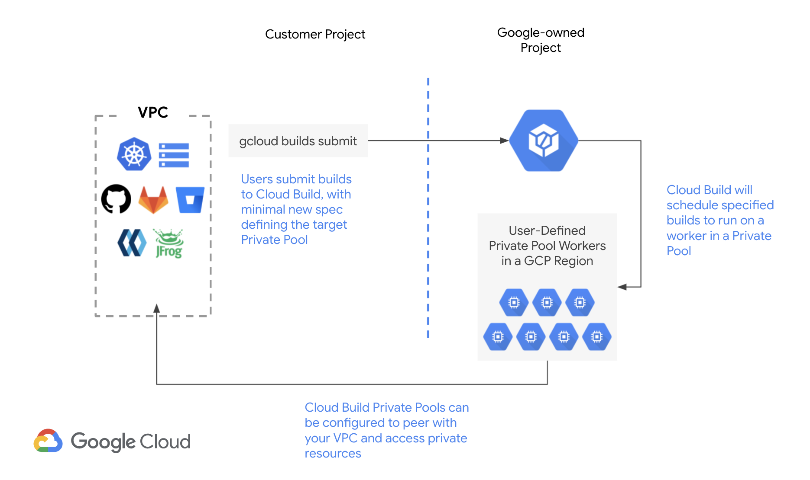

# Accessing private resources using Cloud Build Private Pools

In this repository, we will demonstrate the below functionality of Cloud Build Private Pools:

* Private connectivity to resources in your VPC
* Running builds within a specific region on Google-managed workers
* Large range of machine types configurable for workers that run your build



The above functionality in Private Pools is achieved with the same schema users are used to in Cloud Build.

This will be demonstrated by:

* Running a private sample application on a GKE cluster, exposed on a private RFC1918 IP address via an Internal Load Balancer
* Accessing the sample application from a build running on Cloud Build Private Pools

## Prerequisites

This walkthrough requires that you have the below prerequisites:

* Unix workstation
* gcloud
* kubectl
* GCP Project with Cloud Build API, Service Networking API, and Kubernetes Engine API enabled
* Permissions to create VPC networks, GKE clusters, and run builds in Cloud Build

It is highly recommended you utilize a sandbox/test environment for this walkthrough. Cloud Shell is a suitable workstation for this tutorial. 

## Set up environment variables

Begin by setting and optionally changing environment variables that will be used in this walkthrough. 

```
PROJECT_ID=$(gcloud config list project --format=flattened | awk 'FNR == 1 {print $2}')
REGION=us-west1
VPC_NAME=sandbox-vpc-privatepools
SUBNET_NAME=sandbox-vpc-subnet-privatepools
GKE_CLUSTER_NAME=sandbox-gke-privatepools
PRIVATE_POOLS_IP_RANGE_NAME=sandbox-ip-range-private-pools
PRIVATE_POOL_NAME=sandbox-privatepool
```

## Create a VPC 

We will start by creating a VPC in your GCP project. This network will be utilized to run resources for Cloud Build Private Pools to access over a private network connection.

```
gcloud compute networks create $VPC_NAME \
    --project=$PROJECT_ID \
    --subnet-mode=custom
```

Your output should look similar to the below.

```
Created [https://www.googleapis.com/compute/v1/projects/agmsb-k8s/global/networks/sandbox-vpc-privatepools].
NAME                      SUBNET_MODE  BGP_ROUTING_MODE  IPV4_RANGE  GATEWAY_IPV4
sandbox-vpc-privatepools  CUSTOM       REGIONAL
```

Once the VPC has created, we will configure a subnet in the VPC to run the GKE cluster.

```
gcloud compute networks subnets create $SUBNET_NAME \
    --project=$PROJECT_ID \
    --region=$REGION \
    --network=$VPC_NAME \
    --range=10.4.0.0/22 \
    --secondary-range=pod-net=10.0.0.0/14,svc-net=10.4.4.0/22
```

Your output should look similar to the below.

```
Created [https://www.googleapis.com/compute/v1/projects/agmsb-k8s/regions/us-west1/subnetworks/sandbox-vpc-subnet-privatepools].
NAME                             REGION    NETWORK                   RANGE
sandbox-vpc-subnet-privatepools  us-west1  sandbox-vpc-privatepools  10.4.0.0/22
```

## Create a GKE cluster and deploy a private application

Now we will create a GKE cluster. 

```
gcloud container clusters create $GKE_CLUSTER_NAME \
    --project=$PROJECT_ID \
    --network=$VPC_NAME \
    --subnetwork=$SUBNET_NAME \
    --enable-ip-alias \
    --cluster-secondary-range-name=pod-net \
    --services-secondary-range-name=svc-net \
    --region=$REGION \
    --num-nodes=1
```

Your output should look similar to the below.

```
Creating cluster sandbox-gke-privatepools in us-west1...done.                                                                             
Created [https://container.googleapis.com/v1/projects/agmsb-k8s/zones/us-west1/clusters/sandbox-gke-privatepools].
To inspect the contents of your cluster, go to: https://console.cloud.google.com/kubernetes/workload_/gcloud/us-west1/sandbox-gke-privatepools?project=agmsb-k8s
kubeconfig entry generated for sandbox-gke-privatepools.
NAME                      LOCATION  MASTER_VERSION   MASTER_IP      MACHINE_TYPE  NODE_VERSION     NUM_NODES  STATUS
sandbox-gke-privatepools  us-west1  1.19.9-gke.1900  35.230.82.108  e2-medium     1.19.9-gke.1900  3          RUNNING
```

Once the cluster has created, we can deploy a sample application exposed only to the VPC. We will do so by deploying a Kubernetes Deployment exposed via an Internal Load Balancer.
```
kubectl apply -f sample-app/app.yaml
```

Your output should look like the below.

```
deployment.apps/private-app created
service/private-app-svc created
```

After a minute or so, run the below command to get the Internal Load Balancer's IP address for `private-app-svc`.

```
kubectl get svc -l app=private
```

Your output should look similar to the below.
```
NAME              TYPE           CLUSTER-IP   EXTERNAL-IP   PORT(S)        AGE
private-app-svc   LoadBalancer   10.4.6.103   10.4.0.5      80:31143/TCP   2m57s
```

Store the IP address under `EXTERNAL-IP` in the output as an environment variable for retrieval later in the walkthrough. Note that your IP address might look different than the below.

```
ILB=10.4.0.5
```

Now that we have our private resources set up, we can now configure Cloud Build Private Pools. 

## Configure your VPC for Cloud Build Private Pools

Cloud Build Private Pools run workers using the Service Networking API. This enables you to offer your managed services on internal IP addresses. This is achieved by peering the Google-managed VPC running Cloud Build Private Pool workers with your own VPC.

>Note: Cloud Build Private Pools only need to be configured via this method when builds need to access resources over a private network. If you are only looking to use Cloud Build for isolating builds to regions or for getting access to greater optionality of machine types, you do not need to do this. 


We will ensure that the Service Networking API is enabled.
```
gcloud services enable servicenetworking.googleapis.com
```

Next, we will specify a named IP range for the Cloud Build Private Pool to utilize for workers. This must not overlap with any IP ranges we have in our VPC. You can either specify the range explicitly by providing `--address` and `--prefix-length`, or in the below example, you can allow GCP to provision an available range based on a provided `prefix-length`. 

In this example, we are allocating a /24 range for our Cloud Build Private Pool to utilize for workers.

```
 gcloud compute addresses create $PRIVATE_POOLS_IP_RANGE_NAME \
      --global \
      --purpose=VPC_PEERING \
      --prefix-length=24 \
      --network=$VPC_NAME
```
Your output should look similar to the below.
```
Created [https://www.googleapis.com/compute/v1/projects/agmsb-k8s/global/addresses/sandbox-ip-range-private-pools].
```

Now, we can create a peering between the Google-managed VPC and our VPC running our private resources.

```
gcloud services vpc-peerings connect \
    --service=servicenetworking.googleapis.com \
    --ranges=$PRIVATE_POOLS_IP_RANGE_NAME \
    --network=$VPC_NAME \
    --project=$PROJECT_ID
```

Your output will look similar to the below.
```
Operation "operations/pssn.p24-381015962062-12a0a42b-3152-41d0-aaff-0ab4cdb1bde8" finished successfully.
```

## Creating a Cloud Build Private Pool 

Now we can create our Private Pool. We will be editing the `privatepool.yaml` config file to configure the Private Pool settings.

In line 2 of `privatepool.yaml`, replace `<add-project-number>` and `<add-vpc-name>` with your GCP Project number and the value stored in `$VPC_NAME` respectively. 

```
    peeredNetwork: projects/<add-project-number>/global/networks/<add-vpc-name>
```

If you prefer to change the machine type, disk size, or disable Public IPs on the Cloud Build Private Pool, you can do so in lines 4-6. 

```
gcloud alpha builds worker-pools create $PRIVATE_POOL_NAME --config-from-file privatepool.yaml --region $REGION
```

Your output should look similar to the below.
```
Creating worker pool...done.                                                                                                              
Created [https://cloudbuild.googleapis.com/v1beta1/projects/agmsb-k8s/locations/us-west1/workerPools/projects%2F381015962062%2Flocations%2Fus-west1%2FworkerPools%2Fsandbox-privatepool].
NAME                 CREATE_TIME                STATE
sandbox-privatepool  2021-07-28T14:48:37+00:00  RUNNING
```

Now we are ready to run our build!

## Running a build on a Cloud Build Private Pool to access private resources

One of the notable features of Private Pools is that for existing users of Cloud Build, little will change. We will be running a build using the same schema available to useres before Private Pools, adding only two lines of config to specify that the build should run on a Private Pool. 

We will be editing the `cloudbuild.yaml` build config file.

To simulate accessing private resources in our VPC, we will run a `curl` build step that will issue a request successfully to our private sample application on GKE.

In line 3 of `cloudbuild.yaml`, replace `<add-ip-address>` with the IP address for our private application on GKE, which we can access by running `echo $ILB`.

```
  args: ['<add-ip-address>:80']
```

In line 6, replace `<add-project-id>` with your GCP Project ID, `<add-region>` with the value stored in `$REGION`, and `<add-privatepools-name>` with the value stored in `$PRIVATE_POOL_NAME`.

```
  workerPool: 'projects/<add-project-id>/locations/<add-region>/workerPools/<add-privatepools-name>'
```

Now we can submit our build!
```
gcloud builds submit --config=cloudbuild.yaml
```

Your initial output will look similar to the below.
```
Creating temporary tarball archive of 4 file(s) totalling 997 bytes before compression.
Uploading tarball of [.] to [gs://agmsb-k8s_cloudbuild/source/1627484214.946535-9f309a0eec9c4296a6d76d032cb87ebe.tgz]
Created [https://cloudbuild.googleapis.com/v1/projects/agmsb-k8s/locations/us-west1/builds/07c6bbb5-5044-47f8-b508-75758cb7bd61].
Logs are available at [https://console.cloud.google.com/cloud-build/builds;region=us-west1/07c6bbb5-5044-47f8-b508-75758cb7bd61?project=381015962062].
```

Feel free to click the second hyperlink to access logs and details about the build. 

The build output, once completed, should look like the below:

```

----------------------------------------------------------- REMOTE BUILD OUTPUT -----------------------------------------------------------
starting build "07c6bbb5-5044-47f8-b508-75758cb7bd61"

FETCHSOURCE
Fetching storage object: gs://agmsb-k8s_cloudbuild/source/1627484214.946535-9f309a0eec9c4296a6d76d032cb87ebe.tgz#1627484215665319
Copying gs://agmsb-k8s_cloudbuild/source/1627484214.946535-9f309a0eec9c4296a6d76d032cb87ebe.tgz#1627484215665319...
/ [1 files][  857.0 B/  857.0 B]                                                
Operation completed over 1 objects/857.0 B.
BUILD
Already have image (with digest): gcr.io/cloud-builders/curl
  % Total    % Received % Xferd  Average Speed   Time    Time     Time  Current
                                 Dload  Upload   Total   Spent    Left  Speed
100    68  100    68    0     0  12495      0 --:--:-- --:--:-- --:--:-- 13600
Hello, world!
Version: 2.0.0
Hostname: private-app-65fd4cd975-m4gm2
PUSH
DONE
-------------------------------------------------------------------------------------------------------------------------------------------
```

In the build logs, we can see that the `curl` build step completed -- were able to successfully access a private ILB from a build running on Cloud Build Private Pools!

## Cleanup

Delete the GKE cluster.
```
gcloud container clusters delete $GKE_CLUSTER_NAME --region $REGION
```

Delete the Cloud Build Private Pool. 
```
gcloud alpha builds worker-pools delete $PRIVATE_POOL_NAME --region $REGION
```

Delete the VPC.
```
gcloud compute networks delete $VPC_NAME \
    --project=$PROJECT_ID
```
